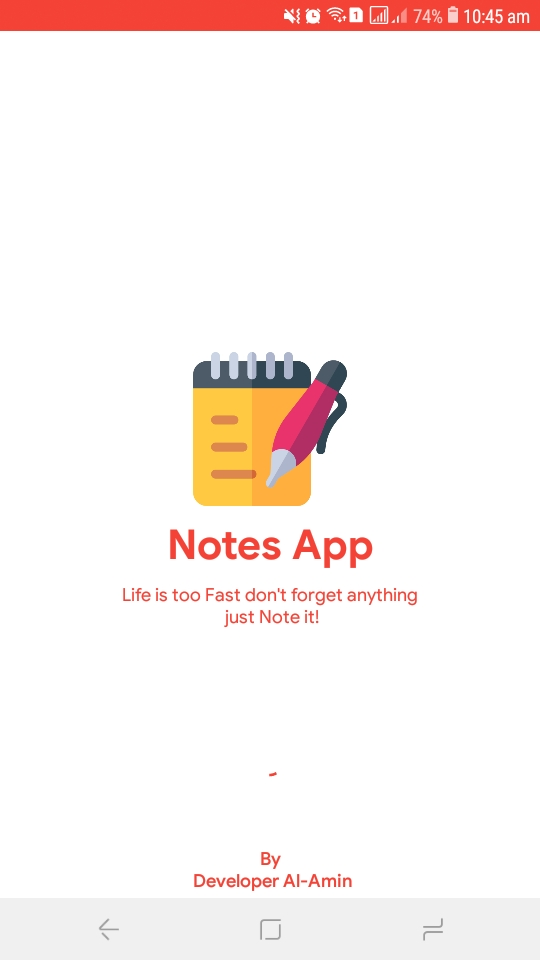

## General
Notes app using Room database & MVVM Architecture

<a id="raw-url" href="apk/Notes App MVVM.apk?raw=true">
</a>


## Screenshots

|                                       Splash Screen                |                            Notes                            |                            Update & Delete                             |
| :------------------------------------------------------------------: | :-----------------------------------------------------------------: | :------------------------------------------------------------------: |
|   |  |   |


## Dependencies 

- Room Database Dependencies

```
implementation "androidx.room:room-runtime:2.3.0"
kapt "androidx.room:room-compiler:2.3.0"
implementation "androidx.room:room-ktx:2.3.0"
androidTestImplementation "androidx.room:room-testing:2.3.0""

```

- Android Architecture Components

```
implementation "androidx.lifecycle:lifecycle-extensions:2.2.0"
implementation "androidx.lifecycle:lifecycle-common-java8:2.3.1"
implementation "androidx.lifecycle:lifecycle-viewmodel-ktx:2.3.1"
implementation 'androidx.activity:activity-ktx:1.3.1'
implementation "org.jetbrains.kotlin:kotlin-stdlib-jdk7:1.5.30"
implementation 'org.jetbrains.kotlinx:kotlinx-coroutines-android:1.5.0'
implementation 'org.jetbrains.kotlinx:kotlinx-coroutines-core:1.5.0'
implementation 'androidx.navigation:navigation-fragment-ktx:2.3.5'
implementation 'androidx.navigation:navigation-ui-ktx:2.3.5'

```


